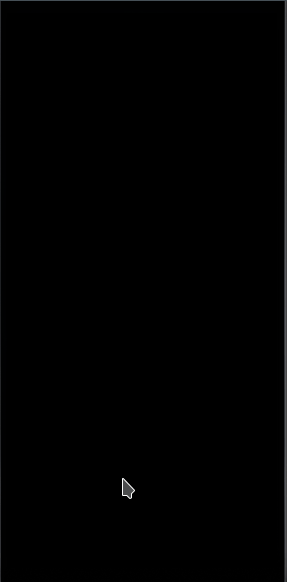

<h1 align="left">SEE APP</h1>

<p align="left">Esse projeto é uma aplicação que exibe dados sobre o clima da cidade pesquisada, e o histórico de pesquisa.</p>

<p align="center">
 <a href="#pré-requisitos">Pré Requisitos</a> |
 <a href="#features">Features</a> |
 <a href="#rodando-o-aplicativo">Rodando a aplicação</a> |
 <a href="#tecnologias">Tecnologias</a>
</p>

---

<h2 align="center">
  

</h2>

<br>

### Pré-requisitos

Antes de começar, você vai precisar ter instalado em sua máquina as seguintes ferramentas:
[Git](https://git-scm.com), [Node.js](https://nodejs.org/en/).

Você também vai precisar configurar o ambiente para desenvolvimento mobile no seu Computador: [Configurando Ambiente React Native](https://react-native.rocketseat.dev/).

Além disto é bom ter um editor para trabalhar com o código como, eu indico o [VSCode](https://code.visualstudio.com/)

Mais um ponto, você precisa criar um chave da API, [Weather API](https://openweathermap.org/api).

### Features

- [x] Ícones parametrizados de acordo com o clima.
- [x] Dark & Light temas
- [x] Busca por cidades
- [x] O tema é persistido
- [x] Consumo da localização do usuário
- [x] Consumo da API de OPEN WEATHER
- [x] Tratativa de erros
- [x] Botão para recarregar os dados
- [ ] Listagem do histórico das cidades pesquisadas
- [ ] Dia/Hora na listagem
- [x] Menu de config para alterar tema e linguagem
- [ ] Menu de config para alterar linguagem

### Rodando o Aplicativo

```bash
# Clone este repositório
$ git clone https://github.com/hgribeiro/SeeApp

# Acesse a pasta do projeto no terminal/cmd
$ cd SeeApp

# Faça uma cópia de '.env.example' para '.env'
$ cp .env.example .env


# Coloque sua credencial da API de clima (Weather API) no arquivo .env


# Instale as dependências com YARN ou NPM
$ yarn or npm install

# Se você for emular com o Android, execute este comando
# Certifique-se de ter o emulador aberto
$ yarn android

# Se você for emular com ios, execute este comando
$ yarn ios
```

### Tecnologias

As seguintes ferramentas foram usadas na construção do projeto:

- [React Native](https://reactnative.dev/)
- [TypeScript](https://www.typescriptlang.org/)
- [Weather API](https://openweathermap.org/api)
- [Context API](https://pt-br.reactjs.org/docs/context.html)
- [Mobx](https://mobx.js.org/README.html)
- [React Native Geolocation Service](https://github.com/Agontuk/react-native-geolocation-service)
- [React Navigation](https://reactnavigation.org/)
- [React Native Vector Icons](https://github.com/oblador/react-native-vector-icons)
- [UnForm](https://unform.dev/)
- [Yup](https://github.com/jquense/yup)
- [Styled Components](https://styled-components.com/)
- [Axios](https://github.com/axios/axios)
- [Eslint](https://eslint.org/)
- [Prettier](https://prettier.io/)
- [EditorConfig](https://editorconfig.org/)

---

<div>
